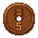
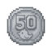
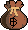

# Frequently Asked Questions

Scroll thtough this page to see the list of our most frequently asked questions. If have a question that you feel is important and is not listed here, open a ticket on the discord server so that staff can add it to the list.

### Joining The Server

`Joining Through Technic`

1. [Download 64-Bit Java for Minecraft](https://java-for-minecraft.com/en/). 
2. [Download the Technic Launcher](https://www.technicpack.net/download). 
3. Open the Technic Launcher, search for the mod pack "One Piece Adventures at Sea" and install it.
4. Click on Launcher Options and allocate around 50% of your computer's total RAM to the Technic Launcher. This should be around 8-16 GB depending on your computer's RAM. You will likely need at least a 16 GB computer to run this modpack as an 8GB computer may crash upon loading.
5. Load up the mod pack and join in on the fun! The IP and server are already included in the mod pack.

`Joining Through Minecraft Launcher`

1. [Download 64-Bit Java for Minecraft](https://java-for-minecraft.com/en/). 
2. Download Minecraft Version 1.16.5 and Forge Version 36.2.39 in your Minecraft Launcher.
3. [Download](https://www.dropbox.com/scl/fi/e578ow4w2vnuiofyim6it/onepieceaas.zip?rlkey=fkvxu9kcrwmpke3nu1chinpc3&st=kjy3om0n&dl=0) all of the mods and add them to your mods folder.
4. Load up the mod pack and join in on the fun! The IP and server are already included in the mod pack.

### Getting Started

`Getting Started`

The purpose of the game is to go through the storyline in One Piece, similar to the way the Straw Hats go through their journey! Upon joining the server, you'll wind up at Spawn Island. Talk to the Tutorial NPCs there to learn about the server. There will also be a Teleporter NPC there to take you wherever you need to go as long as the island is unlocked.

`Progressing Through The Story`

Talk to the Teleporter at Spawn to take you to Foosha Village and start your journey! As soon as you arrive there, talk to Luffy to start the main quest. Each island has a main questline, so to get to the next island, complete the main questline of the island you are currently on and the option for the next island will be available in the Teleporter interface.

`Basic Starting Tips`

We recommend you use your starter gear that you received when spawning into the server to help fight bosses. Be sure to also take a look around Goa Kingdom since you will always be coming back here to use the shops and essential NPCs like bankers for storage, currency exchange, food merchants, etc.

### Questing Basics

`Main Quests`

Every island has the main quest giver near the area you initially teleport to. Speak to them to begin the quest. Once you complete the first part of the quest, the next part will appear in your quest log until you complete the final part. Upon completion, you will unlock the warp for the next island. Simply speak to the final NPC in the questline to warp to the next island. Upon completion, the island will unlock within the Teleporter NPC as well so you can access it at any time.

`Side Quests`

You will notice that islands also have side quests. The quest giver NPCs are scattered around so you are encouraged to adventure around each island you visit. Most side quests are only specific to their island, however some will require you to travel around the One Piece world while others may give you access to new locations upon completion.

### Getting Gear

`Starter Gear`

You will get a free set of starter gear the moment you land in the server. This should help you defeat the early bosses and move through the storyline in a smoother fashion. This gear can also be repaired and upgraded so hold onto it as you will only get the one set.

`Custom Gear`

Armor and weapons also drop from NPCs. As you progress through the story, you will be able to unlock the ability to fight a wider variety of characters that drop their own gear. For more information on how custom gear works and the list of gear that drops from various bosses, check out the Gear and Island Guide sections of this Wiki.

`Player Market`

If you're lucky, another player may be selling a weapon you are looking for so keep an eye on the [Item Search Channel](https://discord.com/channels/1385526041807949855/1394218892330537103) to see if there's anything that you can afford.

### Server Currency

`Belly`

The main currency is Belly. It is used to purchase items or commodities from a variety of shops or other players. Belly can be converted into higher and lower volumes by talking to the Bank Teller NPC at Goa Kingdom and various other islands with banks.

|Currency Denominations|
|-------------|
| |
| |
| |
| |
| |
| |
| |
| |
| |
| |

`How To Get Rich`

1. All bosses drop belly based on their difficulty, so defeating them is a great way to earn belly.
2. Complete quests. Rewards will get better as the game progresses. Questlines can be repeated weekly, so make sure to do them often. If you complete a questline, the payout is equal to defeating all of the bosses that are a part of the questline. 
3. Selling useful items such as swords, armor and devil fruits to other players and to merchants in game that are set up to purchase items.
4. Salvaging unused gear. 

### Devil Fruits

`Buying Devil Fruits`

You can use in-game currency that you get from killing enemies and completing quests to buy Crate Keys from the merchants at Goa Kingdom which you can then use to roll for a random fruit depending on it's tier. 

`Earning Devil Fruits`

Some bosses have a low chance of dropping fragments of their devil fruits. You can farm these bosses and trade their fragments in for the entire fruit to the fragment traders at Goa Kingdom.

`Trading Devil Fruits`

Trading with or buying fruits from other players in the Market Channels on Discord or in game is a great way to get a devil fruit. You can also sell your possessions to other players to save up for a fruit or even a crate key.

`Winning Devil Fruits`

There may be occasional events and giveaways where you can win a devil fruit! We don't do these often and they come at random times so keep an eye out on the [Item Search Channel](https://discord.com/channels/1385526041807949855/1388360081640521850) in the Discord.

`Removing Your Devil Fruit`

You can talk to the Devil Fruit Remover at Goa Kingdom to remove your devil fruit for a price. Be sure that you want to remove your fruit because the change is permanent. If you have a Yami Yami No Mi combination with another fruit, both fruits will be removed in this process.

### Crews

`Basic Information`

There is a Factions System in the game where you can start or join a crew. Type /f help in game for a list of commands. Be sure to check the [Crew Recruitment Channel](https://discord.com/channels/1385526041807949855/1408560501700431943) for any crews that are actively recruiting.

`Creating A Crew & Faction Base`

1. Start a Crew: /f create <crew name>
2. Join a Crew: /f join <crew name> 
3. Claim Crew Land: /f claim
4. Set Crew Home: /f sethome
5. Teleport to Faction Base: /f home

The more power your crew has, the more land you can claim. Power is attained by staying alive and the max power a crew can have depends on their member count.

`Managing A Crew`

1. Invite a Player: /f invite <player name> 
2. Kick a Player: /f kick <player name>. 
3. Promote a Player: /f promote <player name>
4. Ally Another Crew: /f ally <crew name>
5. Truce Another Crew: /f truce <crew name>
6. Enemy Another Crew: /f enemy <crew name>
7. Disband Crew: /f disband

New members are automatically recruits; however, they can be promoted to members and officers. Members can use chests, doors and build on claimed land and officers can claim land, invite new members, kick crew members and decide relations with other crews. 